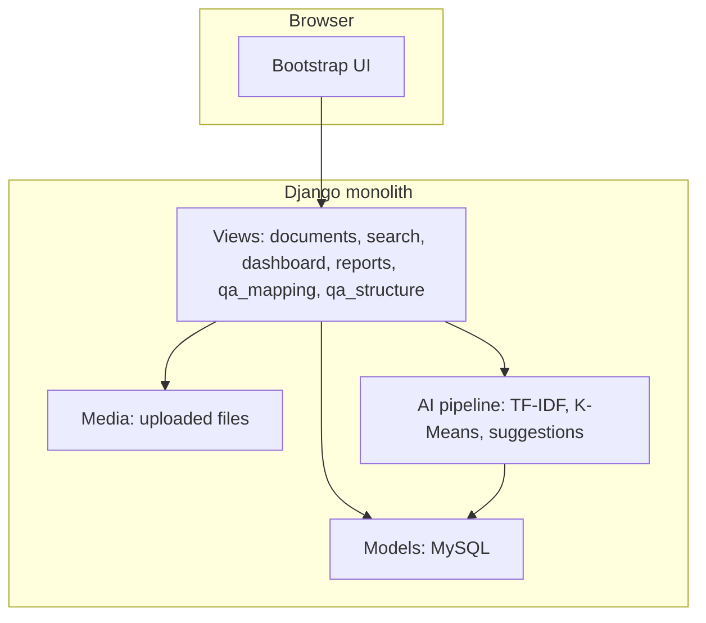

# QA Archiving System — Architecture

## Purpose

Web application for the Quality Assurance Office to **store**, **search**, **cluster**, and **map** accreditation-style evidence (documents) to **QA requirements**, with role-based access and reporting.

## High-level diagram

## Request flow (typical)

1. **Auth** (`accounts`) — session login; roles: Administrator, QA Head (`qa_staff`), Faculty (area-scoped).
2. **Documents** — upload (bulk), repository (filters + pagination), detail, **serve** (inline file bytes), download, browser **view** (PDF / image / docx-preview).
3. **Search** — query `search_documents()` over metadata + extracted text + keywords.
4. **QA mapping** — programs, checklist requirements, CSV/XLSX import; per-program completion is computed by `QAProgram.progress_summary()`.
5. **QA structure** — AACCUP hierarchy (Area → Parameter → Category → Indicator → Required Evidence).
6. **Dashboard / reports** — aggregates and CSV/ZIP exports.
7. **Notifications / chatbot** — auxiliary UX.

## AI / data pipeline (conceptual)

- **Ingest** → text extraction (PDF/DOCX/XLSX, optional OCR).
- **Features** → TF-IDF keywords; optional full corpus clustering when document count ≤ `AI_AUTO_FULL_PIPELINE_MAX_DOCS`.
- **Outputs** → stored on `Document` (keywords, cluster, duplicates, suggestions) for search and mapping UI.

## Deployment notes

- **Static**: `collectstatic` to CDN or app server; **media** on durable volume (S3-compatible optional future work).
- **TLS behind proxy**: set `USE_TLS` and/or `TRUST_X_FORWARDED_SSL`, `USE_X_FORWARDED_HOST` (see README environment table).
- **Database**: MySQL / MariaDB only, configured through the `MYSQL_*` variables in `.env`, using **PyMySQL** from `requirements-prod.txt` (Windows-friendly; optional `mysqlclient` on Linux). The system will not start without `MYSQL_DATABASE`.

## Known limitations (honest scope)

- **DOCX in-browser preview** uses `docx-preview` (HTML); complex Word layout, some headers/footers, and fields may differ from Microsoft Word — **Download** is the fidelity reference.
- **AI quality** depends on extracted text quality and corpus size; clustering is exploratory, not a certification decision.

## Evaluation angles (capstone)

1. **Traceability**: can staff find a document and see which requirement it supports (and which requirements still have no evidence, per the program progress bars)?
2. **Efficiency**: time to locate evidence vs manual folder search (pilot questionnaire or timed task).
3. **Reliability**: upload → view → download success rate in your test environment; expand automated tests over time.
